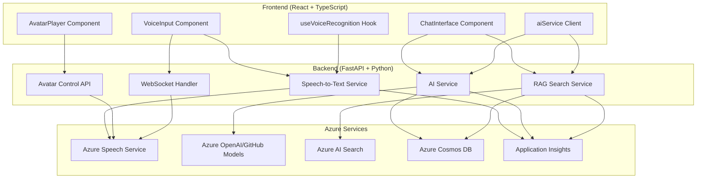
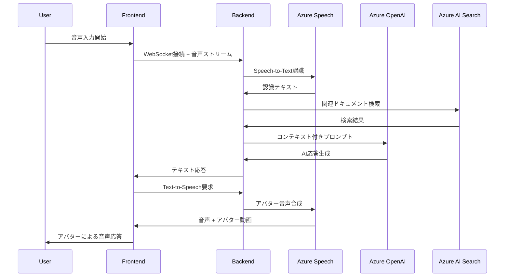

# 技術アーキテクチャ設計: AI 強化アバターシステム

## システム全体アーキテクチャ



## データフロー設計

### 完全音声対話フロー



## コンポーネント設計詳細

### 1. 音声入力システム

#### VoiceInput Component

```typescript
interface VoiceInputProps {
  onTranscript: (text: string) => void;
  onError: (error: string) => void;
  isEnabled: boolean;
  language?: string;
}

interface VoiceInputState {
  isRecording: boolean;
  audioLevel: number;
  recognitionResult: string;
  error: string | null;
}
```

#### useVoiceRecognition Hook

```typescript
interface VoiceRecognitionConfig {
  language: string;
  continuous: boolean;
  interimResults: boolean;
  maxAlternatives: number;
}

interface VoiceRecognitionResult {
  transcript: string;
  confidence: number;
  isFinal: boolean;
}
```

### 2. AI 対話システム

#### aiService Client

```typescript
interface ChatRequest {
  message: string;
  sessionId?: string;
  context?: ConversationContext;
  useRAG?: boolean;
}

interface ChatResponse {
  response: string;
  sessionId: string;
  sources?: DocumentSource[];
  confidence: number;
}

interface ConversationContext {
  history: ChatMessage[];
  userProfile?: UserProfile;
  sessionMetadata: Record<string, any>;
}
```

### 3. RAG 検索システム

#### SearchService

```python
class DocumentSource:
    title: str
    content: str
    url: Optional[str]
    metadata: Dict[str, Any]
    score: float

class RAGSearchService:
    async def search_documents(
        self,
        query: str,
        top_k: int = 5,
        filters: Optional[Dict] = None
    ) -> List[DocumentSource]:
        pass

    async def generate_context(
        self,
        query: str,
        search_results: List[DocumentSource]
    ) -> str:
        pass
```

## データモデル設計

### 会話履歴モデル

```python
# Cosmos DB用のモデル
class ConversationSession(BaseModel):
    id: str
    user_id: str
    session_id: str
    created_at: datetime
    updated_at: datetime
    messages: List[ChatMessage]
    metadata: Dict[str, Any]

class ChatMessage(BaseModel):
    id: str
    role: Literal["user", "assistant"]
    content: str
    timestamp: datetime
    audio_data: Optional[str]  # Base64エンコードされた音声データ
    sources: Optional[List[DocumentSource]]
    confidence: Optional[float]
```

### 検索インデックス設計

```json
{
  "name": "documents-index",
  "fields": [
    { "name": "id", "type": "Edm.String", "key": true },
    { "name": "title", "type": "Edm.String", "searchable": true },
    { "name": "content", "type": "Edm.String", "searchable": true },
    { "name": "category", "type": "Edm.String", "filterable": true },
    { "name": "url", "type": "Edm.String" },
    { "name": "created_at", "type": "Edm.DateTimeOffset", "sortable": true },
    {
      "name": "content_vector",
      "type": "Collection(Edm.Single)",
      "searchable": true,
      "vectorSearchDimensions": 1536
    }
  ],
  "vectorSearch": {
    "profiles": [
      {
        "name": "semantic-profile",
        "algorithm": "hnsw",
        "vectorizer": "azure-openai-text-embedding-3-large"
      }
    ]
  }
}
```

## API 設計

### RESTful API エンドポイント

#### 音声認識 API

```python
@router.post("/api/speech/recognize")
async def recognize_speech(
    audio_file: UploadFile,
    language: str = "ja-JP",
    format: str = "wav"
) -> RecognitionResult

@router.websocket("/api/speech/stream")
async def stream_speech_recognition(websocket: WebSocket)
```

#### AI 対話 API

```python
@router.post("/api/ai/chat")
async def chat(request: ChatRequest) -> ChatResponse

@router.get("/api/ai/sessions/{session_id}")
async def get_session(session_id: str) -> ConversationSession

@router.delete("/api/ai/sessions/{session_id}")
async def delete_session(session_id: str) -> DeleteResult
```

#### RAG 検索 API

```python
@router.post("/api/search/semantic")
async def semantic_search(
    query: SearchQuery
) -> SearchResult

@router.post("/api/search/documents/upload")
async def upload_document(
    file: UploadFile,
    metadata: DocumentMetadata
) -> UploadResult
```

### WebSocket API 設計

#### リアルタイム音声処理

```python
class WebSocketMessage:
    type: Literal["audio_chunk", "recognition_result", "error", "status"]
    data: Union[bytes, str, Dict[str, Any]]
    timestamp: datetime

# メッセージタイプ
# audio_chunk: 音声データチャンク
# recognition_result: 認識結果
# error: エラー情報
# status: 接続状態情報
```

## セキュリティ・プライバシー設計

### 1. 認証・認可

```python
# JWT ベースの認証
class UserSession:
    user_id: str
    session_id: str
    permissions: List[str]
    expires_at: datetime

# API キー管理
class APIKeyManager:
    async def get_azure_openai_key(self) -> str
    async def get_speech_service_key(self) -> str
    async def get_search_service_key(self) -> str
```

### 2. データプライバシー

```python
# 個人情報のマスキング
class PrivacyFilter:
    async def mask_personal_info(self, text: str) -> str
    async def anonymize_audio_data(self, audio: bytes) -> bytes

# データ保持ポリシー
class DataRetentionPolicy:
    audio_retention_days: int = 1  # 音声データは1日で削除
    conversation_retention_days: int = 30  # 会話履歴は30日保持
    log_retention_days: int = 90  # ログは90日保持
```

### 3. レート制限

```python
# Redis ベースのレート制限
class RateLimiter:
    async def check_rate_limit(
        self,
        user_id: str,
        endpoint: str,
        window_seconds: int = 60,
        max_requests: int = 100
    ) -> bool
```

## パフォーマンス最適化設計

### 1. キャッシュ戦略

```python
# Redis キャッシュ
class CacheService:
    async def cache_ai_response(
        self,
        query_hash: str,
        response: str,
        ttl_seconds: int = 3600
    ) -> None

    async def cache_search_results(
        self,
        query_hash: str,
        results: List[DocumentSource],
        ttl_seconds: int = 1800
    ) -> None
```

### 2. 非同期処理

```python
# Celery を使用したバックグラウンドタスク
@celery_app.task
async def process_audio_async(audio_data: bytes, session_id: str) -> None:
    """音声データの非同期処理"""
    pass

@celery_app.task
async def update_search_index(document: Document) -> None:
    """検索インデックスの非同期更新"""
    pass
```

### 3. 接続プール管理

```python
# データベース接続プール
class ConnectionManager:
    cosmos_client: CosmosClient
    search_client: SearchClient
    redis_client: Redis

    async def init_connections(self) -> None
    async def close_connections(self) -> None
```

## 監視・ログ設計

### 1. Application Insights 統合

```python
class TelemetryService:
    async def track_conversation_event(
        self,
        session_id: str,
        event_type: str,
        properties: Dict[str, Any]
    ) -> None

    async def track_performance_metric(
        self,
        metric_name: str,
        value: float,
        tags: Dict[str, str]
    ) -> None
```

### 2. 構造化ログ

```python
# JSON構造化ログ
logger = structlog.get_logger()

await logger.info(
    "ai_response_generated",
    session_id=session_id,
    response_time_ms=response_time,
    model_used=model_name,
    token_count=token_count,
    user_id=user_id
)
```

### 3. メトリクス収集

```python
# Prometheus メトリクス
from prometheus_client import Counter, Histogram, Gauge

# カウンター
CONVERSATION_COUNT = Counter('conversations_total', 'Total conversations')
ERROR_COUNT = Counter('errors_total', 'Total errors', ['error_type'])

# ヒストグラム
RESPONSE_TIME = Histogram('response_time_seconds', 'Response time distribution')
AUDIO_PROCESSING_TIME = Histogram('audio_processing_seconds', 'Audio processing time')

# ゲージ
ACTIVE_SESSIONS = Gauge('active_sessions', 'Number of active sessions')
```

---

_この技術設計書は実装の進捗に応じて継続的に更新・詳細化されます。_
